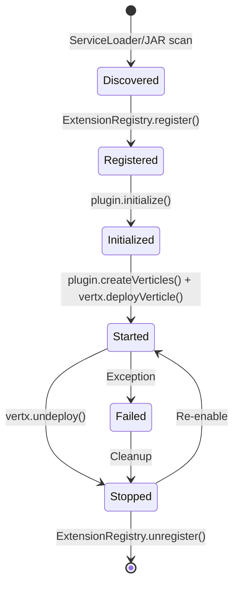

# Plugin Architecture Implementation Guide

**Status**: Planning Phase  
**Target Version**: 2.0.0  
**Estimated Effort**: 6-9 months  
**Last Updated**: January 29, 2026

## Table of Contents

1. [Executive Summary](#executive-summary)
2. [Current State Analysis](#current-state-analysis)
3. [Target Architecture](#target-architecture)
4. [Implementation Phases](#implementation-phases)
5. [Technical Design](#technical-design)
6. [Migration Strategy](#migration-strategy)
7. [Testing Strategy](#testing-strategy)
8. [Risk Mitigation](#risk-mitigation)
9. [Success Metrics](#success-metrics)

---

## Executive Summary

Transform MonsterMQ from a monolithic broker (~500MB, 70+ dependencies) into a modular plugin-based architecture with:
- **Slim core** (~100MB): MQTT protocol, session management, event bus, storage layer
- **Optional plugins**: OPC UA, PLC4X, Neo4j, Kafka, GraphQL, GenAI, Flow Engine, etc.
- **Dynamic loading**: Enable/disable features without recompilation
- **Reduced startup time**: Load only needed plugins
- **Better maintenance**: Independent plugin development and versioning

### Key Benefits
- ✅ Faster startup for minimal deployments
- ✅ Reduced memory footprint (load only what you need)
- ✅ Independent plugin updates (no full broker rebuild)
- ✅ Third-party plugin ecosystem potential
- ✅ Better dependency isolation (no classpath conflicts)

### Key Challenges
- ⚠️ Classpath isolation complexity
- ⚠️ GraphQL schema dynamic composition
- ⚠️ Configuration backward compatibility
- ⚠️ Cluster coordination across plugins
- ⚠️ Plugin versioning and compatibility

---

## Current State Analysis

### Monolithic Architecture

**Entry Point**: `broker/src/main/kotlin/Monster.kt`
- Lines 38-51: Hardcoded imports for ALL extensions
- Lines 640-1040: Sequential `.compose()` chain deploying each extension
- Zero dynamic loading capability

**Current Features** (all hardcoded):
```
Core MQTT Broker (Essential)
├── Session Handler
├── Archive Handler  
├── Metrics Handler
└── Storage Layer

Device Integration (15+ extensions)
├── OPC UA Client/Server (Eclipse Milo, ~93MB)
├── MQTT Client (Eclipse Paho)
├── Kafka Client (Vert.x Kafka)
├── PLC4X (9 protocol drivers, ~120MB)
├── Neo4j Client (Neo4j Driver)
├── WinCC OA/UA
├── SparkplugB Decoder
└── Oa4j Bridge

API/Services
├── GraphQL Server (22+ resolvers)
├── MCP Server
├── Grafana Server
└── API Service (JSON-RPC)

Advanced Features
├── Flow Engine (GraalVM, ~200MB)
├── GenAI Provider (Google GenAI)
└── JDBC Logger (Postgres, MySQL, SQLite, Snowflake)
```

**Total JAR Size**: ~500MB  
**Dependency Count**: 70+ in `pom.xml`

### Existing Plugin-Ready Patterns

✅ **Vert.x Verticle System**
```kotlin
vertx.deployVerticle(verticle, options)  // Already supports dynamic deployment
vertx.undeploy(deploymentId)              // Already supports undeployment
```

✅ **EventBus Communication**
```kotlin
// Decoupled messaging between components
eventBus.send("mq.cluster.broadcast", message)
eventBus.consumer("mq.device.config.update") { ... }
```

✅ **DeviceConfig Abstraction**
```kotlin
// Generic device model with type field
DeviceConfig(
    id = UUID,
    type = "OPCUA-Client",  // Plugin type identifier
    config = JsonObject()    // Plugin-specific config
)
```

✅ **Interface-Based Design**
- `IDeviceConfigStore` - Device configuration storage
- `IMessageStore` - Message persistence
- `IMessageBus` - Messaging abstraction
- `ISessionStoreSync/Async` - Session management
- `IGenAiProvider` - AI provider abstraction

---

## Target Architecture

### Core Module (broker-core)

**Size**: ~100MB  
**Dependencies**: Minimal essentials only

```
broker-core/
├── MQTT Protocol Handler (Vert.x MQTT)
├── Session Management (SessionHandler)
├── Message Routing (MessageBus)
├── Event Bus (EventBusAddresses)
├── Storage Layer (IMessageStore, ISessionStore)
│   ├── PostgreSQL
│   ├── SQLite
│   ├── MongoDB
│   └── CrateDB
├── Authentication (UserManager, ACL)
├── Configuration (YAML loader)
└── Plugin System
    ├── ExtensionRegistry
    ├── PluginLoader (ServiceLoader)
    └── Plugin Lifecycle Manager
```

### Plugin Modules

Each plugin as separate Maven module:

```
broker-plugins/
├── broker-plugin-opcua/
│   ├── pom.xml (Eclipse Milo dependencies)
│   └── src/main/kotlin/plugins/opcua/
│       ├── OpcUaPlugin.kt
│       ├── OpcUaExtension.kt
│       └── META-INF/services/BrokerPlugin
│
├── broker-plugin-neo4j/
│   ├── pom.xml (Neo4j dependencies)
│   └── src/main/kotlin/plugins/neo4j/
│       ├── Neo4jPlugin.kt
│       ├── Neo4jExtension.kt
│       └── META-INF/services/BrokerPlugin
│
├── broker-plugin-plc4x/
├── broker-plugin-kafka/
├── broker-plugin-graphql/
├── broker-plugin-flowengine/
├── broker-plugin-genai/
├── broker-plugin-jdbclogger/
├── broker-plugin-sparkplugb/
├── broker-plugin-grafana/
└── broker-plugin-mcp/
```

### Plugin API Contract

```kotlin
// broker-core/src/main/kotlin/api/BrokerPlugin.kt
interface BrokerPlugin {
    /** Unique plugin identifier (e.g., "opcua-client") */
    fun getId(): String
    
    /** Human-readable plugin name */
    fun getName(): String
    
    /** Plugin version (semantic versioning) */
    fun getVersion(): String
    
    /** Broker version compatibility (e.g., "1.6.x", "2.0+") */
    fun getBrokerCompatibility(): String
    
    /** Plugin dependencies (other plugin IDs) */
    fun getDependencies(): List<String> = emptyList()
    
    /** Initialize plugin (called once at startup) */
    fun initialize(vertx: Vertx, config: JsonObject, registry: ServiceRegistry): Future<Void>
    
    /** Create verticle instances for deployment */
    fun createVerticles(): List<AbstractVerticle>
    
    /** Optional GraphQL schema contribution */
    fun getGraphQLSchema(): String? = null
    
    /** Optional device types supported */
    fun getSupportedDeviceTypes(): List<String> = emptyList()
    
    /** Cleanup resources */
    fun destroy(): Future<Void> = Future.succeededFuture()
}
```

### ServiceRegistry Pattern

```kotlin
// Shared services available to all plugins
interface ServiceRegistry {
    fun <T> getService(clazz: Class<T>): T?
    fun <T> registerService(clazz: Class<T>, instance: T)
    fun getVertx(): Vertx
    fun getEventBus(): EventBus
    fun getConfig(): JsonObject
    fun getDeviceConfigStore(): IDeviceConfigStore
    fun getMessageStore(): IMessageStore
    fun getSessionStore(): ISessionStoreAsync
}
```

---

## Implementation Phases

### Phase 1: Foundation (4-6 weeks)

**Goal**: Create plugin API without breaking existing functionality

#### Step 1.1: Create Plugin API
- [ ] Create `broker-api` module with `BrokerPlugin` interface
- [ ] Create `ServiceRegistry` interface
- [ ] Create `PluginMetadata` data class
- [ ] Create `PluginException` hierarchy

**Files to create**:
```
broker-api/
├── pom.xml
└── src/main/kotlin/at/rocworks/api/
    ├── BrokerPlugin.kt
    ├── ServiceRegistry.kt
    ├── PluginMetadata.kt
    └── PluginException.kt
```

#### Step 1.2: Implement Extension Registry
- [ ] Create `ExtensionRegistry` singleton
- [ ] Add registration methods (`register()`, `unregister()`)
- [ ] Add lookup methods (`getPlugin()`, `getAllPlugins()`)
- [ ] Add lifecycle state tracking (REGISTERED, INITIALIZED, STARTED, STOPPED)

**File to create**: `broker/src/main/kotlin/plugins/ExtensionRegistry.kt`

```kotlin
object ExtensionRegistry {
    private val plugins = ConcurrentHashMap<String, PluginContext>()
    
    data class PluginContext(
        val plugin: BrokerPlugin,
        val metadata: PluginMetadata,
        val state: PluginState,
        val deploymentIds: MutableList<String> = mutableListOf()
    )
    
    enum class PluginState {
        REGISTERED, INITIALIZED, STARTED, STOPPED, FAILED
    }
    
    fun register(plugin: BrokerPlugin): Future<Void> { ... }
    fun initialize(pluginId: String, vertx: Vertx, config: JsonObject): Future<Void> { ... }
    fun start(pluginId: String, vertx: Vertx): Future<Void> { ... }
    fun stop(pluginId: String, vertx: Vertx): Future<Void> { ... }
    fun unregister(pluginId: String): Future<Void> { ... }
}
```

#### Step 1.3: Convert 3 Simple Extensions
- [ ] Convert `Neo4jExtension` to `Neo4jPlugin`
- [ ] Convert `JDBCLoggerExtension` to `JDBCLoggerPlugin`
- [ ] Convert `SparkplugBDecoderExtension` to `SparkplugBPlugin`

**Why these three?**
- Minimal shared state dependencies
- Self-contained functionality
- No GraphQL schema coupling
- Easy to test independently

#### Step 1.4: Update Monster.kt (Hybrid Mode)
- [ ] Keep existing hardcoded initialization
- [ ] Add plugin registry initialization
- [ ] Add config flag: `plugins.mode: "legacy" | "hybrid" | "plugins-only"`
- [ ] In hybrid mode, use registry for converted plugins

**Configuration example**:
```yaml
plugins:
  mode: hybrid  # legacy, hybrid, or plugins-only
  enabled:
    - neo4j
    - jdbc-logger
    - sparkplugb
```

### Phase 2: Dynamic Loading (6-8 weeks)

**Goal**: Implement ServiceLoader discovery and plugin packaging

#### Step 2.1: ServiceLoader Integration
- [ ] Add `META-INF/services/at.rocworks.api.BrokerPlugin` files
- [ ] Implement `PluginLoader` class using `ServiceLoader.load()`
- [ ] Add plugin validation (version compatibility checks)
- [ ] Add dependency resolution (topological sort)

**File to create**: `broker/src/main/kotlin/plugins/PluginLoader.kt`

```kotlin
class PluginLoader(private val vertx: Vertx) {
    fun discoverPlugins(): Future<List<BrokerPlugin>> {
        return vertx.executeBlocking { promise ->
            val plugins = ServiceLoader.load(BrokerPlugin::class.java).toList()
            promise.complete(plugins)
        }
    }
    
    fun validatePlugin(plugin: BrokerPlugin): ValidationResult { ... }
    fun resolveDependencies(plugins: List<BrokerPlugin>): List<BrokerPlugin> { ... }
}
```

#### Step 2.2: Plugin Directory Support
- [ ] Add `plugins/` directory scanning
- [ ] Implement JAR loading with `URLClassLoader`
- [ ] Add classpath isolation (parent-first vs child-first)
- [ ] Add plugin unloading (close classloaders)

**Configuration**:
```yaml
plugins:
  directory: ./plugins
  classloading:
    mode: parent-first  # parent-first or child-first
    isolated: true      # separate classloader per plugin
```

#### Step 2.3: Convert More Extensions
- [ ] Convert `OpcUaExtension` → `OpcUaPlugin`
- [ ] Convert `MqttClientExtension` → `MqttClientPlugin`
- [ ] Convert `KafkaClientExtension` → `KafkaPlugin`
- [ ] Convert `Plc4xExtension` → `Plc4xPlugin`

#### Step 2.4: Plugin Configuration System
- [ ] Add plugin-specific config sections
- [ ] Implement config validation per plugin
- [ ] Add config hot-reload support
- [ ] Add config migration tools

**Configuration example**:
```yaml
plugins:
  opcua-client:
    enabled: true
    config:
      maxConnectionPoolSize: 10
      reconnectDelay: 5000
  
  neo4j:
    enabled: true
    config:
      batchSize: 1000
```

### Phase 3: Core-Plugin Separation (8-10 weeks)

**Goal**: Split codebase into broker-core and separate plugin modules

#### Step 3.1: Create Maven Multi-Module Project
- [ ] Create parent POM with modules
- [ ] Create `broker-core` module
- [ ] Create `broker-api` module
- [ ] Create plugin modules (10+)

**New directory structure**:
```
monster-mq-org/
├── pom.xml (parent)
├── broker-api/
│   └── pom.xml
├── broker-core/
│   └── pom.xml (minimal dependencies)
├── broker-plugins/
│   ├── pom.xml (parent for all plugins)
│   ├── opcua-plugin/
│   ├── neo4j-plugin/
│   ├── plc4x-plugin/
│   ├── kafka-plugin/
│   ├── graphql-plugin/
│   ├── flowengine-plugin/
│   ├── genai-plugin/
│   ├── jdbclogger-plugin/
│   ├── sparkplugb-plugin/
│   ├── grafana-plugin/
│   └── mcp-plugin/
└── broker-distribution/
    └── pom.xml (assembly)
```

#### Step 3.2: Move Dependencies to Plugins
- [ ] Remove OPC UA deps from core (Eclipse Milo → opcua-plugin)
- [ ] Remove PLC4X deps from core (~120MB → plc4x-plugin)
- [ ] Remove GraalVM deps from core (~200MB → flowengine-plugin)
- [ ] Remove GenAI deps from core (~30MB → genai-plugin)
- [ ] Remove Neo4j deps from core (~50MB → neo4j-plugin)

**Target**: broker-core JAR from 500MB → ~100MB

#### Step 3.3: GraphQL Plugin System
- [ ] Design GraphQL schema federation
- [ ] Create `GraphQLSchemaContributor` interface
- [ ] Implement schema merging at runtime
- [ ] Update all 18+ resolver files to be plugin-contributed

**GraphQL Plugin API**:
```kotlin
interface GraphQLSchemaContributor {
    fun getSchemaString(): String
    fun getQueryResolvers(): Map<String, DataFetcher<*>>
    fun getMutationResolvers(): Map<String, DataFetcher<*>>
    fun getTypeResolvers(): Map<String, TypeResolver>
}
```

#### Step 3.4: Distribution Assembly
- [ ] Create thin distribution (core only)
- [ ] Create full distribution (core + all plugins)
- [ ] Create custom distribution tool (select plugins)
- [ ] Update Docker images (multi-stage build)

**Build profiles**:
```bash
mvn clean package -P thin       # Core only (~100MB)
mvn clean package -P full       # All plugins (~500MB)
mvn clean package -P opcua,neo4j # Custom selection
```

### Phase 4: Advanced Features (10-12 weeks)

**Goal**: Plugin marketplace, hot deployment, monitoring

#### Step 4.1: Plugin Metadata & Registry
- [ ] Design plugin manifest format (JSON/YAML)
- [ ] Add versioning scheme (semantic versioning)
- [ ] Add license information
- [ ] Add author/maintainer info
- [ ] Add compatibility matrix

**Plugin manifest** (`plugin.json`):
```json
{
  "id": "opcua-client",
  "name": "OPC UA Client Plugin",
  "version": "2.0.0",
  "brokerCompatibility": "2.0.x",
  "author": "MonsterMQ Team",
  "license": "Apache-2.0",
  "dependencies": [],
  "mainClass": "at.rocworks.plugins.opcua.OpcUaPlugin",
  "description": "OPC UA client integration",
  "homepage": "https://github.com/vogler75/monster-mq",
  "tags": ["opcua", "industrial", "iot"]
}
```

#### Step 4.2: Hot Deployment
- [ ] Implement plugin upload API (GraphQL/REST)
- [ ] Add plugin install/uninstall commands
- [ ] Add plugin enable/disable without restart
- [ ] Add plugin update mechanism
- [ ] Handle cluster synchronization

**API**:
```graphql
type Mutation {
  installPlugin(jarFile: Upload!): PluginInstallResult
  uninstallPlugin(pluginId: String!): Boolean
  enablePlugin(pluginId: String!): Boolean
  disablePlugin(pluginId: String!): Boolean
  updatePlugin(pluginId: String!, jarFile: Upload!): PluginUpdateResult
}

type Query {
  listPlugins(status: PluginStatus): [Plugin]
  getPlugin(pluginId: String!): Plugin
}
```

#### Step 4.3: Plugin Isolation & Security
- [ ] Implement SecurityManager for plugins
- [ ] Add permission system (file access, network, etc.)
- [ ] Add resource limits (CPU, memory)
- [ ] Add plugin sandboxing
- [ ] Add code signing verification

#### Step 4.4: Plugin Marketplace
- [ ] Create plugin repository server
- [ ] Add plugin search/browse UI
- [ ] Add plugin ratings/reviews
- [ ] Add automatic dependency resolution
- [ ] Add plugin statistics (downloads, usage)

#### Step 4.5: Documentation & Tooling
- [ ] Write plugin development guide
- [ ] Create plugin archetype (Maven)
- [ ] Create plugin CLI tool
- [ ] Add plugin debugging guide
- [ ] Create plugin examples repository

---

## Technical Design

### Plugin Lifecycle



### ClassLoader Hierarchy

```
Bootstrap ClassLoader
    ↓
System ClassLoader (broker-core.jar)
    ↓
Plugin ClassLoader 1 (opcua-plugin.jar)
    ├── Eclipse Milo classes
    └── OpcUaPlugin class
    
Plugin ClassLoader 2 (neo4j-plugin.jar)
    ├── Neo4j Driver classes
    └── Neo4jPlugin class
```

**Isolation Rules**:
- Core classes visible to all plugins (shared API)
- Plugin classes NOT visible to other plugins
- Plugins communicate via EventBus only
- Shared dependencies (Vert.x, Kotlin stdlib) loaded from core

### Plugin Communication

**Allowed**:
- ✅ EventBus messages (loosely coupled)
- ✅ ServiceRegistry (core services)
- ✅ Shared data structures (DeviceConfig, MessageBus)

**Forbidden**:
- ❌ Direct class references between plugins
- ❌ Reflection across plugin boundaries
- ❌ Filesystem sharing (except temp dir)

### Configuration Schema Evolution

#### Version 1.x (Current - Monolithic)
```yaml
Mqtt:
  # MQTT config
  
Devices:
  OpcUaClients:
    - Id: client1
      # OPC UA config
  
  Neo4jClients:
    - Id: neo4j1
      # Neo4j config
```

#### Version 2.0 (Plugin-Based)
```yaml
Mqtt:
  # MQTT config (backward compatible)

Plugins:
  mode: plugins-only
  directory: ./plugins
  enabled:
    - opcua-client
    - neo4j
  
  opcua-client:
    config:
      # Plugin-specific config
  
  neo4j:
    config:
      # Plugin-specific config

# Legacy device configs still supported via migration
Devices:
  OpcUaClients: []  # Migrated to plugin config
```

### Database Schema Changes

Add plugin metadata table:
```sql
CREATE TABLE plugin_metadata (
    plugin_id VARCHAR(255) PRIMARY KEY,
    plugin_name VARCHAR(255) NOT NULL,
    version VARCHAR(50) NOT NULL,
    enabled BOOLEAN DEFAULT TRUE,
    installed_at TIMESTAMP DEFAULT CURRENT_TIMESTAMP,
    config JSONB,
    state VARCHAR(50),  -- REGISTERED, STARTED, STOPPED, FAILED
    error_message TEXT
);

CREATE INDEX idx_plugin_enabled ON plugin_metadata(enabled);
```

---

## Migration Strategy

### Backward Compatibility

#### Option 1: Legacy Mode (Default)
```yaml
plugins:
  mode: legacy  # Behaves exactly like v1.x
```
- All extensions loaded as before
- No plugin system active
- Zero migration needed

#### Option 2: Hybrid Mode
```yaml
plugins:
  mode: hybrid
  enabled:
    - neo4j  # Loaded as plugin
    - jdbc-logger  # Loaded as plugin
    # Others loaded legacy way
```
- Gradual migration
- Mix of old and new
- Test plugins incrementally

#### Option 3: Plugin-Only Mode
```yaml
plugins:
  mode: plugins-only
  enabled:
    - opcua-client
    - neo4j
    - graphql
    # Must explicitly list all needed plugins
```
- Full plugin architecture
- Maximum performance
- Requires configuration update

### Configuration Migration Tool

```bash
# Analyze current config
java -jar broker-migrator.jar analyze --config config.yaml

# Generate plugin-based config
java -jar broker-migrator.jar migrate --config config.yaml --output config-v2.yaml

# Validate new config
java -jar broker-migrator.jar validate --config config-v2.yaml
```

### Database Migration

```bash
# Run Flyway migration
java -jar broker.jar --migrate-db

# Applied migrations:
# V2.0.0__create_plugin_metadata_table.sql
# V2.0.1__migrate_device_configs.sql
```

### Docker Migration

**Old (v1.x)**:
```dockerfile
FROM openjdk:21
COPY broker.jar /app/
CMD ["java", "-jar", "/app/broker.jar"]
```

**New (v2.0 - full)**:
```dockerfile
FROM openjdk:21
COPY broker-core.jar /app/
COPY plugins/ /app/plugins/
CMD ["java", "-jar", "/app/broker-core.jar"]
```

**New (v2.0 - minimal)**:
```dockerfile
FROM openjdk:21
COPY broker-core.jar /app/
COPY plugins/graphql-plugin.jar /app/plugins/
CMD ["java", "-jar", "/app/broker-core.jar"]
```

---

## Testing Strategy

### Unit Tests
- [ ] Test each plugin in isolation
- [ ] Test plugin lifecycle (init, start, stop)
- [ ] Test ServiceRegistry
- [ ] Test ExtensionRegistry
- [ ] Test PluginLoader

### Integration Tests
- [ ] Test plugin discovery
- [ ] Test plugin dependencies resolution
- [ ] Test multiple plugins together
- [ ] Test EventBus communication between plugins
- [ ] Test GraphQL schema merging

### Compatibility Tests
- [ ] Test v1.x config loading in legacy mode
- [ ] Test v1.x config loading in hybrid mode
- [ ] Test migration tool
- [ ] Test database migrations
- [ ] Test rollback scenarios

### Performance Tests
- [ ] Measure startup time (core only vs full)
- [ ] Measure memory usage (minimal vs full plugins)
- [ ] Measure plugin loading time
- [ ] Measure message throughput (before/after)
- [ ] Measure latency (before/after)

### Cluster Tests
- [ ] Test plugin deployment in clustered mode
- [ ] Test plugin state synchronization
- [ ] Test plugin failover
- [ ] Test plugin hot deployment in cluster

### Security Tests
- [ ] Test plugin isolation (classloader boundaries)
- [ ] Test plugin permissions (file, network access)
- [ ] Test malicious plugin scenarios
- [ ] Test plugin code signing

---

## Risk Mitigation

### Risk 1: Classpath Hell
**Probability**: HIGH  
**Impact**: HIGH

**Description**: Conflicting dependencies between plugins (e.g., different Jackson versions)

**Mitigation**:
1. Use parent-first classloading for common dependencies (Vert.x, Kotlin, Jackson)
2. Use child-first classloading for plugin-specific dependencies
3. Document allowed/forbidden dependency versions
4. Provide dependency conflict detection tool
5. Use shaded JARs for problematic dependencies

### Risk 2: Performance Degradation
**Probability**: MEDIUM  
**Impact**: HIGH

**Description**: Plugin abstraction overhead, classloader overhead, EventBus overhead

**Mitigation**:
1. Benchmark before and after each phase
2. Use direct references where possible (via ServiceRegistry)
3. Cache plugin lookups
4. Optimize EventBus message serialization
5. Profile and identify bottlenecks early

### Risk 3: Breaking Existing Deployments
**Probability**: MEDIUM  
**Impact**: HIGH

**Description**: Configuration format changes, database schema changes, behavior changes

**Mitigation**:
1. Maintain legacy mode indefinitely (v1.x behavior)
2. Provide hybrid mode for gradual migration
3. Extensive configuration validation
4. Automated migration tools
5. Clear migration guide with examples
6. Beta testing period with early adopters

### Risk 4: GraphQL Schema Conflicts
**Probability**: MEDIUM  
**Impact**: MEDIUM

**Description**: Multiple plugins defining same GraphQL types, queries, or mutations

**Mitigation**:
1. Namespace plugin schemas (e.g., `opcua_`, `neo4j_` prefixes)
2. Schema validation at plugin registration
3. Clear schema contribution guidelines
4. Schema conflict detection tool
5. Allow schema override in config

### Risk 5: Plugin Quality Issues
**Probability**: HIGH  
**Impact**: MEDIUM

**Description**: Poorly written third-party plugins crash broker, leak resources, etc.

**Mitigation**:
1. Plugin certification program
2. Resource limits per plugin (memory, CPU)
3. Plugin sandboxing (SecurityManager)
4. Plugin review process for marketplace
5. Easy plugin disable/uninstall
6. Circuit breaker pattern (isolate failing plugins)

### Risk 6: Cluster Coordination
**Probability**: MEDIUM  
**Impact**: MEDIUM

**Description**: Plugin state inconsistency across cluster nodes

**Mitigation**:
1. Use Hazelcast distributed maps for plugin state
2. Cluster-wide plugin enable/disable commands
3. Leader-based plugin deployment
4. Plugin version consistency checks
5. Cluster health monitoring per plugin

### Risk 7: Documentation Lag
**Probability**: HIGH  
**Impact**: MEDIUM

**Description**: Documentation doesn't keep up with implementation changes

**Mitigation**:
1. Document API as it's developed (not after)
2. Generate API docs from code (KDoc/Javadoc)
3. Maintain migration guide with each phase
4. Create video tutorials for plugin development
5. Community feedback loop (early adopters)

---

## Success Metrics

### Technical Metrics

#### Startup Time
- **Baseline** (v1.x full): ~15 seconds
- **Target** (v2.0 core only): <5 seconds ✅
- **Target** (v2.0 with 3 plugins): <8 seconds ✅

#### Memory Usage
- **Baseline** (v1.x full): ~800MB
- **Target** (v2.0 core only): <300MB ✅
- **Target** (v2.0 with 3 plugins): <500MB ✅

#### JAR Size
- **Baseline** (v1.x full): ~500MB
- **Target** (v2.0 core): <100MB ✅
- **Target** (v2.0 full distribution): ~500MB (acceptable, but modular)

#### Message Throughput
- **Requirement**: <5% degradation vs v1.x
- **Target**: Same or better throughput

### Quality Metrics

#### Test Coverage
- **Core module**: >80% code coverage
- **Each plugin**: >70% code coverage
- **Integration tests**: 100+ scenarios

#### Plugin Count
- **Phase 1**: 3 plugins converted
- **Phase 2**: 7 plugins converted
- **Phase 3**: All 15+ features as plugins
- **Phase 4**: 1-2 community plugins

### Adoption Metrics

#### Configuration Migration
- **Target**: 90% automated migration success rate
- **Fallback**: Clear manual migration guide for remaining 10%

#### Documentation
- **Plugin development guide**: Complete
- **Migration guide**: Complete with examples
- **API reference**: Auto-generated from code
- **Video tutorials**: At least 3 videos

#### Community Engagement
- **Early adopters**: 5+ organizations beta testing
- **Issue resolution**: <48 hours median response time
- **Community plugins**: At least 1 third-party plugin by end of Phase 4

---

## Action Plan Checklist

### Pre-Implementation
- [ ] Review this document with team
- [ ] Estimate resources (developers, time)
- [ ] Identify beta testing partners
- [ ] Set up CI/CD for multi-module build
- [ ] Create project tracking (JIRA, GitHub Projects)

### Phase 1 Kickoff
- [ ] Create `broker-api` module
- [ ] Implement `BrokerPlugin` interface
- [ ] Implement `ExtensionRegistry`
- [ ] Convert Neo4j, JDBC Logger, SparkplugB to plugins
- [ ] Add hybrid mode to Monster.kt
- [ ] Write unit tests
- [ ] Document API

### Phase 2 Kickoff
- [ ] Implement `PluginLoader` with ServiceLoader
- [ ] Add plugin directory scanning
- [ ] Implement classloader isolation
- [ ] Convert 4 more extensions to plugins
- [ ] Add plugin configuration system
- [ ] Write integration tests

### Phase 3 Kickoff
- [ ] Create Maven multi-module structure
- [ ] Split core and plugins
- [ ] Move dependencies to plugins
- [ ] Implement GraphQL schema federation
- [ ] Create distribution assembly
- [ ] Update Docker images
- [ ] Write migration tools

### Phase 4 Kickoff
- [ ] Implement plugin hot deployment
- [ ] Add plugin metadata system
- [ ] Implement plugin security
- [ ] Create plugin marketplace
- [ ] Write comprehensive documentation
- [ ] Launch beta program

---

## References

### Code Locations
- **Main entry point**: `broker/src/main/kotlin/Monster.kt` (lines 640-1040)
- **Extensions**: `broker/src/main/kotlin/extensions/`
- **Devices**: `broker/src/main/kotlin/devices/`
- **GraphQL resolvers**: `broker/src/main/kotlin/graphql/` (18+ files)
- **Storage interfaces**: `broker/src/main/kotlin/stores/`
- **EventBus addresses**: `broker/src/main/kotlin/bus/EventBusAddresses.kt`

### Similar Projects
- **Apache Karaf**: OSGi-based plugin system
- **Jenkins**: Plugin architecture with 1500+ plugins
- **Grafana**: Plugin system for panels, data sources, apps
- **Eclipse RCP**: Rich plugin ecosystem

### Technologies
- **Vert.x**: Event-driven, non-blocking, already supports dynamic verticle deployment
- **ServiceLoader**: Java's built-in plugin discovery mechanism
- **URLClassLoader**: Dynamic JAR loading
- **Maven Assembly**: Creating distribution packages

---

## Appendix: Quick Reference Commands

### Development
```bash
# Build core only
mvn clean package -pl broker-core

# Build specific plugin
mvn clean package -pl broker-plugins/opcua-plugin

# Build all plugins
mvn clean package -pl broker-plugins

# Run tests
mvn test

# Run integration tests
mvn verify -P integration-tests
```

### Distribution
```bash
# Create thin distribution (core only)
mvn clean package -P thin

# Create full distribution (all plugins)
mvn clean package -P full

# Create custom distribution
mvn clean package -P custom -Dplugins=opcua,neo4j,graphql
```

### Docker
```bash
# Build core image
docker build -t monster-mq:core -f docker/Dockerfile.core .

# Build full image
docker build -t monster-mq:full -f docker/Dockerfile.full .

# Run with custom plugins
docker run -v ./plugins:/app/plugins monster-mq:core
```

### Plugin Management
```bash
# List plugins
curl http://localhost:8080/api/plugins

# Install plugin
curl -F "file=@opcua-plugin.jar" http://localhost:8080/api/plugins/install

# Enable plugin
curl -X POST http://localhost:8080/api/plugins/opcua-client/enable

# Disable plugin
curl -X POST http://localhost:8080/api/plugins/opcua-client/disable
```

---

**End of Implementation Guide**

This document will be updated as implementation progresses. Current status: **PLANNING PHASE**
